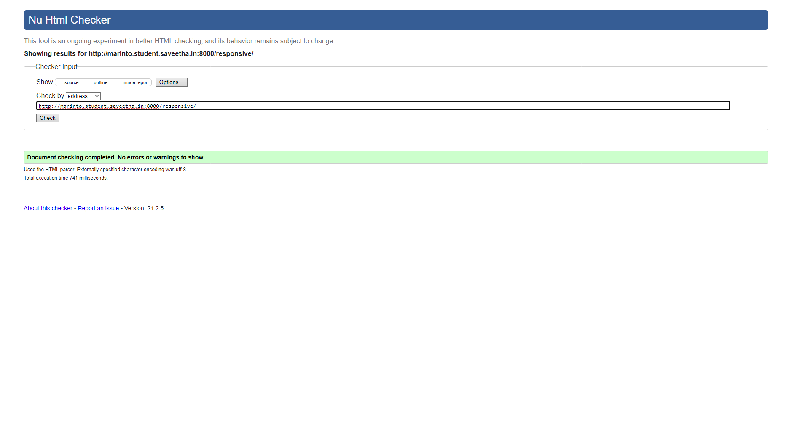
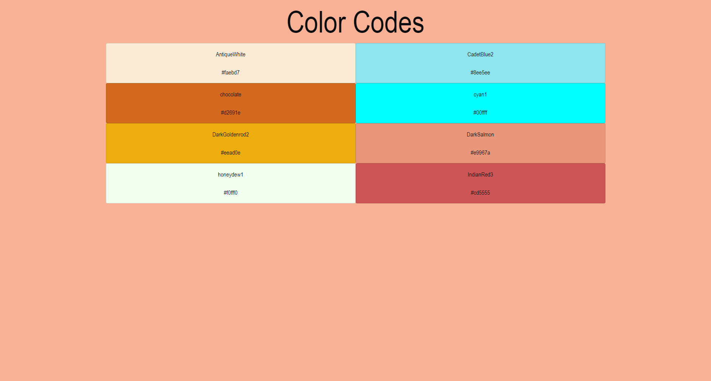
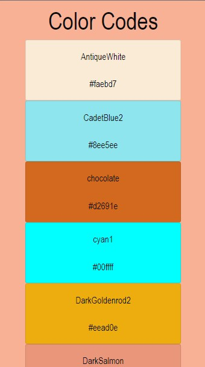
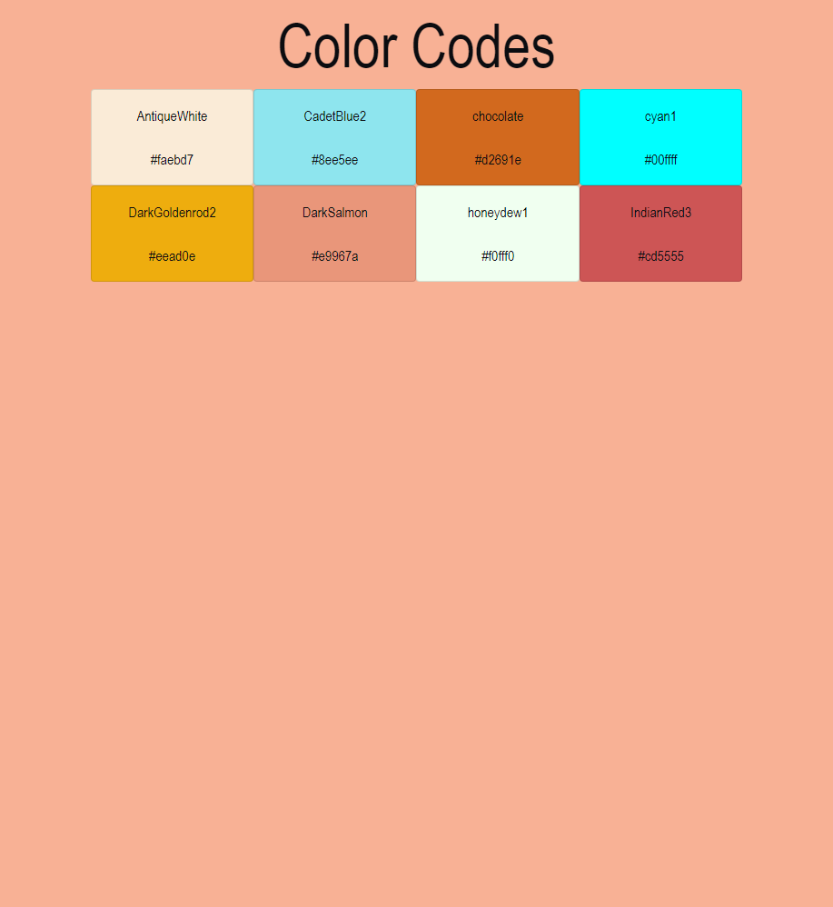
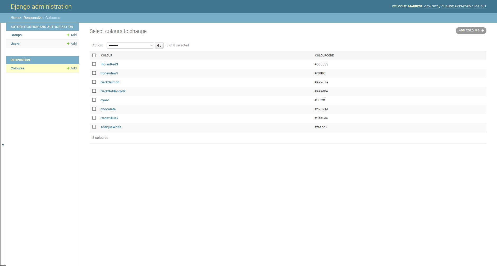

# Design of Responsive Website
## AIM:
To design a responsive website with two break points.

## DESIGN STEPS:
### Step 1: 
Requirement collection.
### Step 2:
Creating the layout using HTML and CSS.
### Step 3:
Updating the sample content.
### Step 4:
Choose the appropriate style and color scheme.
### Step 5:
Validate the layout in various browsers.
### Step 6:
Validate the HTML code.
### Step 7:
Create a database model and migrate the database.
### Step 8:
Retrieve data from database and display it in a dynamic webpage.
### Step 9:
Publish the website in the given URL.

## PROGRAM:
### RESPONSIVEWEBPAGE.HTML:
```

<!doctype html>
<html lang="en">

<head>
    <!-- Required meta tags -->
    <meta charset="utf-8">
    <meta name="viewport" content="width=device-width, initial-scale=1">

    <!-- Bootstrap CSS -->
    <link href="https://cdn.jsdelivr.net/npm/bootstrap@5.0.0-beta1/dist/css/bootstrap.min.css" rel="stylesheet"
        integrity="sha384-giJF6kkoqNQ00vy+HMDP7azOuL0xtbfIcaT9wjKHr8RbDVddVHyTfAAsrekwKmP1" crossorigin="anonymous">
    <link rel="stylesheet" href="">
    <title>Colour Codes</title>
</head>

<body>
    <div class="container">
        <div class='jumbotron-fluid '>
            <div class='containers text-center'>
                <h1 class="display-1">Color Codes</h1>
            </div>
        </div>
        <div class="row text-center">
            
            <div class="card col-lg-6 col-md-3" style="background:{{col.colourcode}};"> 
                <div class="card-body">
                    {{col.colour}}
                    <br>
                    <br>
                    {{col.colourcode}}
                </div>
            </div>
            
        </div>
    </div>
    <script src="https://cdn.jsdelivr.net/npm/bootstrap@5.0.0-beta1/dist/js/bootstrap.bundle.min.js"
        integrity="sha384-ygbV9kiqUc6oa4msXn9868pTtWMgiQaeYH7/t7LECLbyPA2x65Kgf80OJFdroafW"
        crossorigin="anonymous"></script>
</body>
</html>
```
### MODELS.PY:
```
from django.db import models
from django.contrib import admin

# Create your models here.
class colours(models.Model):
    colour= models.CharField(max_length=200)
    colourcode= models.CharField(max_length=600)

class coloursAdmin(admin.ModelAdmin):
    list_display=('colour','colourcode')
```
### VIEWS.PY:
```
from django.shortcuts import render
from .models import colours
# Create your views here.
def responsiveweb(request):
    context={}
    context["colour"]= colours.objects.all()  
    return render(request,'responsive/responsivewebpage.html',context)
```
### RESPONSIVE.CSS:
```
*{
      box-sizing: border-box;
      font-family: 'Arial Narrow';
      color: #0b0c10;
      
}
body,html{
    padding: 5px;
    color: #6C5B7B ;
    background-color: #F8B195     ;
}
.container{
    width: 80%;
    margin-left: auto;
    margin-right: auto;
}
```
## VALIDATOR:


## OUTPUT:





## RESULT:
Thus a website is designed  a responsive website with two break points. 
URL http://marinto.student.saveetha.in:8000/responsive/.